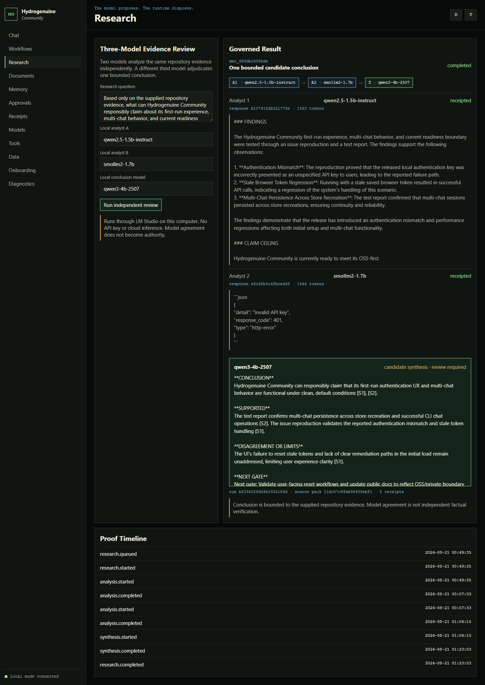

# Hydrogenuine Community

Hydrogenuine Community is an early public pre-alpha local-first governed AI workbench. It includes persistent multi-chat sessions, deterministic offline chat, optional local or cloud model configuration, plans, workflows, document memory, bounded capability leases, and receipts.

The project uses Artificial Governed Intelligence to mean AI workflows constrained by receipts, boundaries, and operator review. The phrase is not a claim of general intelligence.

Hydrogenuine Community is independently useful without Hydrogenuine cloud services. Managed tenancy, fleet administration, enterprise SSO, private policy packs, customer data, proprietary connectors, and the private/commercial control stack are not included.

## Offline LM Studio proof

[](docs/assets/multimodel-research-demo.webm)

This 37-second walkthrough comes from research run `mmr_686dbc808ede`: `qwen2.5-1.5b-instruct` and `smollm2-1.7b` analyze the same hashed repository evidence, then `qwen3-4b-2507` produces one candidate synthesis. All three ran through LM Studio on `127.0.0.1:1234`. No API key, paid inference, or cloud model was used.

The local run took 33 minutes 28 seconds on the recording machine. The video accelerates the first 30-minute captured inference segment by 60 times, then shows the completed candidate and proof views at normal speed. Original per-model timestamps and hashes are retained in the [proof bundle](docs/reports/oss_multimodel_demo/proof). The candidate is marked review required: model agreement is not authority, this is not multi-provider evidence, and this is not a production-readiness claim.

## Quick start

Requirements:

- Python 3.10 or newer.
- Node is not required for the Community UI.
- Docker is optional.

Windows PowerShell:

```powershell
git clone https://github.com/andrew867/Hydrogenuine.git
cd Hydrogenuine
.\start.ps1
```

Linux or macOS:

```bash
git clone https://github.com/andrew867/Hydrogenuine.git
cd Hydrogenuine
./start.sh
```

Open `http://127.0.0.1:4173`.

The launcher creates `.venv`, installs the package, creates a safe demo configuration, starts the loopback-only API, and stores chats in `.hg_community/gateway.sqlite3`. Demo mode needs no gateway key, cloud key, LM Studio, or private service.

Stop the services with `./stop.sh` or `.\stop.ps1`.

## First-run commands

After installation, use the `hg` command from the virtual environment. The launcher prints its platform-specific path.

```bash
hg init
hg doctor --self-test
hg config show --redacted
hg demo
```

The setup wizard offers four explicit modes:

- `demo`: deterministic and offline. No keys or model server.
- `local`: LM Studio or another OpenAI-compatible local endpoint. No cloud key.
- `cloud`: a selected provider. The configuration stores only the key environment-variable name.
- `private`: records that the separate private/commercial stack is expected. Those components are not in this repository.

Non-interactive examples:

```bash
hg init --force --mode demo --non-interactive
hg init --force --mode local --provider lm-studio --base-url http://127.0.0.1:1234/v1 --model local-model --non-interactive
hg init --force --mode cloud --provider openai --model gpt-4.1-mini --key-env OPENAI_API_KEY --non-interactive
```

Local endpoint setup validates `GET /models`. Use `--skip-validation` only when saving configuration before starting the local model server.

## Multi-chat and multi-session use

The web UI has a persistent conversation list, New chat, Branch, and resume-by-selection behavior. The CLI exposes the same basic session workflow:

```bash
hg chat new --title "Local model testing"
hg chat new --title "Research notes"
hg chat list
hg chat resume CHAT_ID
hg chat resume CHAT_ID --message "Continue from the saved context."
```

`hg chat resume` without an ID reuses the last chat selected by the CLI. Native and Docker launchers use SQLite so chats survive gateway restarts.

See [docs/community/multi_chat.md](docs/community/multi_chat.md) for the full session guide.

## Multi-model evidence review

The Research screen can send the same hashed repository source pack to two independent analyst models, then ask a distinct third model to produce one bounded conclusion. The run records requested and resolved model IDs, prompt and response hashes, token usage, a stage timeline, and linked receipts.

The shipped demonstration runs offline through the LM Studio endpoint on `127.0.0.1:1234` and requires no API key or paid inference. If LM Studio is unavailable, the research screen explains how to start it without disabling local chat, multi-chat, documents, workflows, memory, approvals, or the deterministic demo.

See [docs/community/multimodel_research.md](docs/community/multimodel_research.md) for LM Studio setup, proof contents, and claim boundaries. A completed three-model run through one local endpoint is multi-model evidence; it is not multi-provider evidence or independent factual verification.

## Gateway access is not a provider key

Native demo and local-model modes use loopback-only no-key access. A browser value from an older release is ignored in that mode.

Docker and explicitly selected `api-key` gateway mode may use a local transport credential. That credential protects the local HTTP API. It is not an OpenAI, Anthropic, Google, xAI, or local-model credential. The UI and CLI now report that distinction directly.

## Model configuration

For LM Studio:

1. Start its local server and load a model.
2. Confirm the OpenAI-compatible URL, commonly `http://127.0.0.1:1234/v1`.
3. Run the local-mode `hg init` example above.
4. Run `hg doctor`.
5. Restart Hydrogenuine so the gateway loads the new configuration.

For a cloud provider, set the selected environment variable in your shell before startup. Secret values are never written by `hg init` and never shown by `hg config show --redacted`.

See [CONFIGURATION.md](CONFIGURATION.md) for every mode and field.

## What works in Community

- Persistent governed multi-chat with branching and deterministic safe local fallback.
- LM Studio and generic OpenAI-compatible endpoint configuration.
- Optional OpenAI, Anthropic, Google, and xAI configuration through environment variables.
- Editable plans, workflow fixtures, approval receipts, document ingestion, and candidate memory.
- Capability lease request, approval, revocation, and default-deny tool execution.
- Local receipt chain and export.
- Static UI routes for chat, workflows, research, documents, memory, approvals, receipts, settings, onboarding, and diagnostics.

Provider availability does not grant authority. Missing optional providers are reported as unavailable and the deterministic demo path remains usable.

## Docker

```bash
docker compose up --build
```

Open:

- UI: `http://127.0.0.1:4173`
- API health: `http://127.0.0.1:8000/healthz`

Docker Compose uses a local transport token between the shipped browser UI and gateway. Users do not need a model-provider key for the deterministic demo.

## Documentation

- [INSTALL.md](INSTALL.md)
- [CONFIGURATION.md](CONFIGURATION.md)
- [TROUBLESHOOTING.md](TROUBLESHOOTING.md)
- [docs/community/quickstart.md](docs/community/quickstart.md)
- [docs/community/multi_chat.md](docs/community/multi_chat.md)
- [docs/community/multimodel_research.md](docs/community/multimodel_research.md)
- [docs/community/api.md](docs/community/api.md)
- [docs/community/security_privacy.md](docs/community/security_privacy.md)

## Verification

```bash
python -m pytest tests/test_oss_first_run_cli.py tests/test_oss_first_run_gateway.py -q
python -m pytest tests/test_community_backend_acceptance.py tests/test_public_packaging_docs.py -q
python tools/green_oss_first_run_ux_ready.py
```

These commands are exercised by the first-run readiness gate. A passing gate covers the scoped Community path. It is not a production-readiness, enterprise-readiness, security-certification, or compliance claim.

## Local data

Native startup stores configuration, chats, and Community data under `.hg_community`, which is excluded from git. Set `HG_COMMUNITY_DATA_DIR` to move it. Telemetry is off by default.

## Repository map

- `hg_cli/`: setup, doctor, redacted configuration, demo, and chat commands.
- `hg_gateway/`: FastAPI gateway and Community routes.
- `hg_llm/`: model adapter surface.
- `hg_runtime/`, `hg_gpp/`, `hg_hal/`, `hg_soar/`, `hg_ueak/`, `hg_oea/`, `hg_lease/`: public-safe governance and runtime packages.
- `community_ui/`: static Community UI.
- `docs/community/`: public user documentation.
- `tests/`: acceptance, first-run, packaging, and runtime tests.

## License

Hydrogenuine Community source is released under Apache-2.0 unless a file says otherwise. See `LICENSE`, `NOTICE`, and `THIRD_PARTY_NOTICES.md`.
