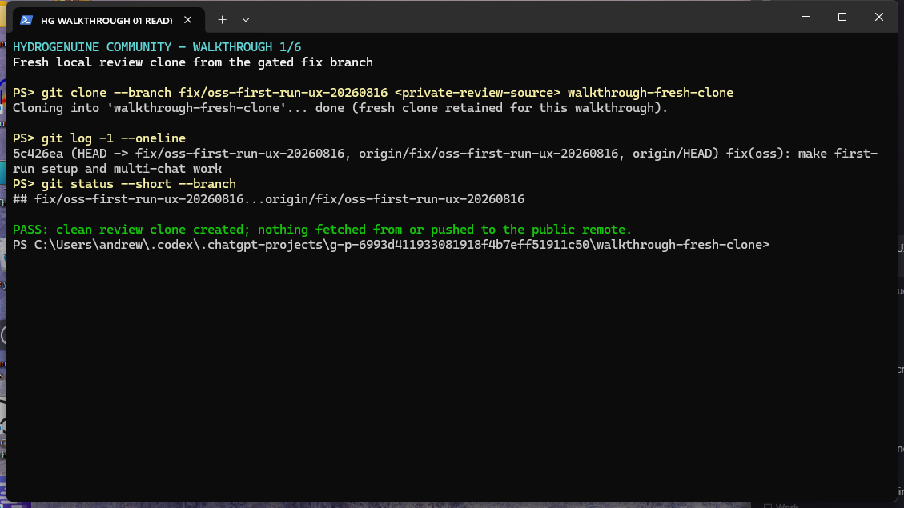
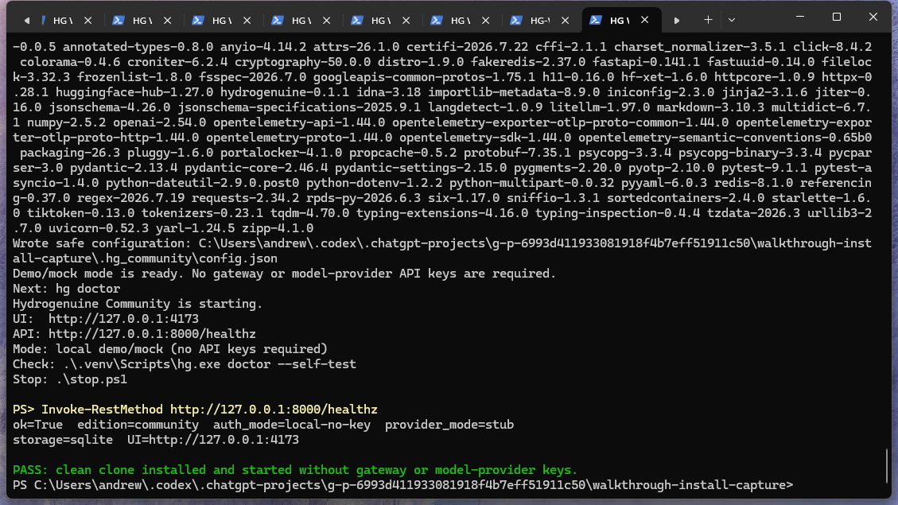
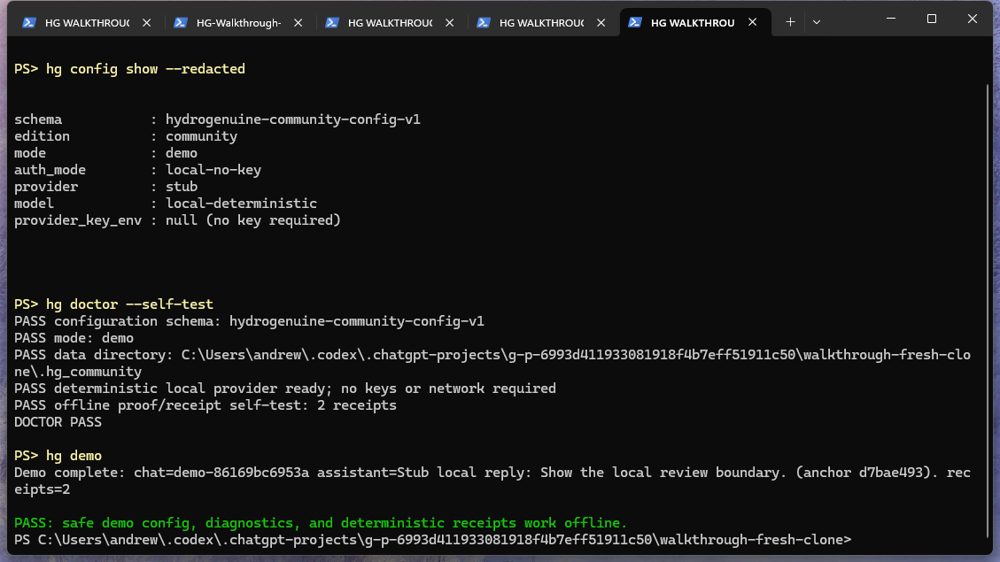
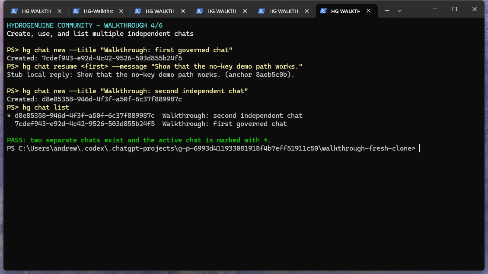
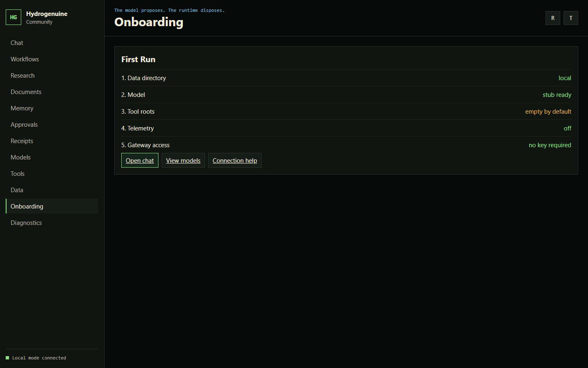
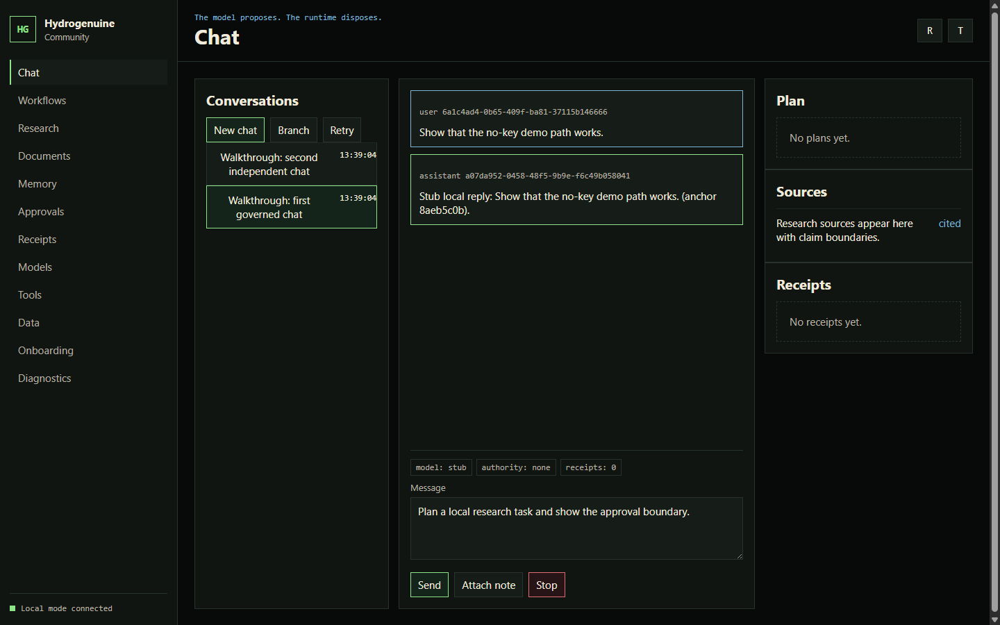
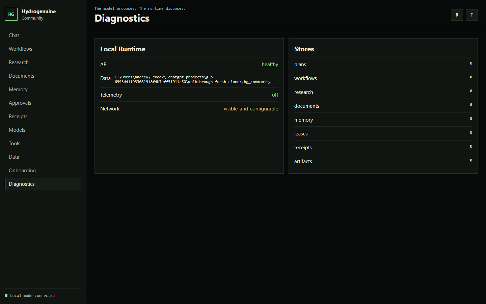
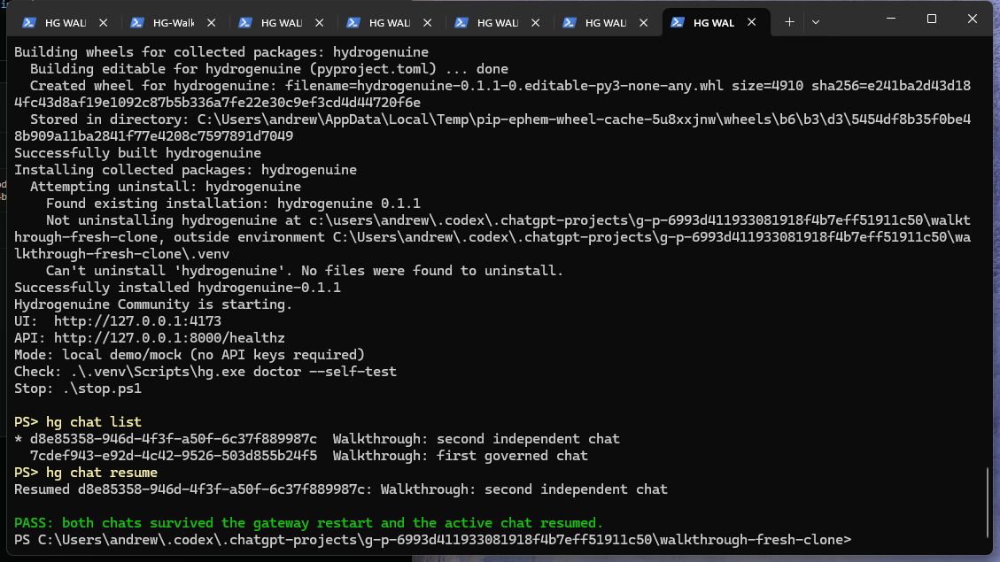
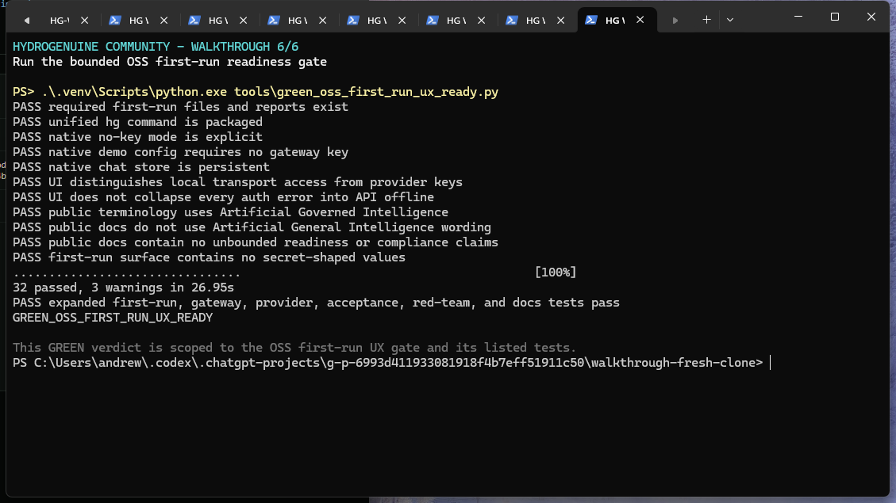

# Hydrogenuine Community first-run walkthrough

Date: 2026-08-16

Status: internal review evidence

Branch: `fix/oss-first-run-ux-20260816`

Commit: `5c426ea670ebbe6c18a284c258d1f5473a98bf87`

This walkthrough demonstrates the bounded Community first-run path on Windows. It covers a clean clone, first installation, automatic demo configuration, diagnostics, offline receipts, multiple chats, browser use, restart persistence, and the scoped readiness gate.

The screenshots contain local filesystem paths and are not public-release assets as-is. They contain no API keys, provider secrets, private endpoints, customer data, or private proof bundles.

## 1. Create a clean review clone

Command:

```powershell
git clone --branch fix/oss-first-run-ux-20260816 <private-review-source> walkthrough-fresh-clone
```

Observed result:

- The clone points at commit `5c426ea`.
- The review branch is clean.
- No public remote was changed.



## 2. Install and start without API keys

Before starting, the OpenAI, Anthropic, Google, xAI, and Hydrogenuine gateway key variables were removed from the process. A second disposable clone with no virtual environment, `.env`, Community configuration, or data directory was used for this first-install capture.

Command:

```powershell
.\start.ps1
```

The launcher created `.venv`, installed the package and development dependencies, wrote the safe demo configuration, and launched the API and UI. The harness retried `/healthz` while the gateway completed its first import because startup is asynchronous.

Observed health:

```text
ok=True
edition=community
auth_mode=local-no-key
provider_mode=stub
storage=sqlite
UI=http://127.0.0.1:4173
```



## 3. Inspect configuration and run diagnostics

Commands:

```powershell
hg config show --redacted
hg doctor --self-test
hg demo
```

Observed result:

- Configuration schema is `hydrogenuine-community-config-v1`.
- Mode is `demo` and gateway access is `local-no-key`.
- Provider is the deterministic local stub.
- Provider key environment reference is null because no key is required.
- Doctor passed.
- The offline self-test and demo each produced two deterministic receipts.



## 4. Create and use multiple chats from the CLI

Commands:

```powershell
hg chat new --title "Walkthrough: first governed chat"
hg chat resume <first-chat-id> --message "Show that the no-key demo path works."
hg chat new --title "Walkthrough: second independent chat"
hg chat list
```

Observed result:

- Two independent chat IDs were created.
- The first chat returned a deterministic local reply.
- `hg chat list` displayed both chats and marked the active chat with `*`.



## 5. Verify browser onboarding

The browser was opened at `http://127.0.0.1:4173` in an isolated session.

The First Run page reports:

- local data directory
- stub model ready
- empty tool roots by default
- telemetry off
- gateway access with no key required



## 6. Verify multi-chat in the browser

The browser loaded both CLI-created conversations. Selecting the first chat showed the original user message and the deterministic assistant reply. The UI reported local mode connected, model `stub`, authority `none`, and zero claimed receipts for this chat turn.



## 7. Verify live diagnostics

The Diagnostics page reported the API healthy, telemetry off, the local Community data directory, and the configured local stores. The browser console contained one favicon `404`; no application request or JavaScript error was observed.



## 8. Restart and confirm persistence

Commands:

```powershell
.\stop.ps1
.\start.ps1
hg chat list
hg chat resume
```

Observed result:

- Both conversations survived the gateway restart.
- The active conversation resumed successfully.
- SQLite remained the configured chat store.



## 9. Run the bounded readiness gate

Command:

```powershell
.\.venv\Scripts\python.exe tools\green_oss_first_run_ux_ready.py
```

Observed result:

- All static first-run, packaging, terminology, secret-shape, and public-claim checks passed.
- The expanded test selection completed with `32 passed` and three existing framework deprecation warnings.
- Final verdict: `GREEN_OSS_FIRST_RUN_UX_READY`.

This GREEN verdict is scoped to the checks and tests named by the OSS first-run UX gate. It is not a production, enterprise, security, or compliance claim.



## Visual review record

All nine retained screenshots were opened and inspected at original resolution. Two diagnostic captures were excluded: one caught the wrong foreground application, and one showed the walkthrough harness probing the wrong health path before that harness was corrected. Neither excluded image is used as evidence.

The retained sequence demonstrates:

1. clean branch provenance
2. genuine first install with no keys
3. safe first-run configuration
4. doctor and offline demo success
5. CLI and browser multi-chat operation
6. live health diagnostics
7. restart persistence
8. the scoped passing gate

`SCREENSHOT_MANIFEST.json` records the byte size and SHA-256 digest of every retained image.
